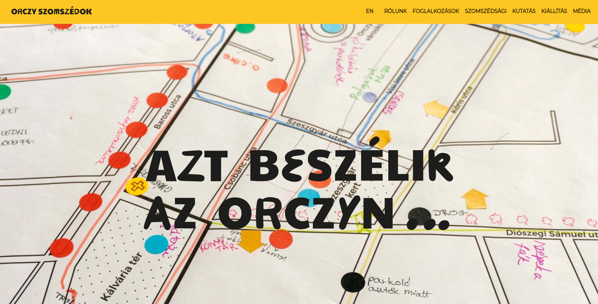

# Next.js Orczy Site

## Overview

This repository contains the code for a website designed for a neighborhood civic engagement project. The site leverages Next.js for its server-side rendering (SSR) capabilities, making it suitable for handling static content efficiently. Styling is accomplished using Material-UI (MUI), and the website is hosted on Firebase.

## Live Website

Visit the live website at [szomszedsagbolkozosseget.hu](https://szomszedsagbolkozosseget.hu).

## Getting Started

To run this project locally, follow these steps:

1. Clone the Repository
2. Navigate to the Project Directory
3. Install Dependencies:
    - npm install
4. Run the Development Server:
    - next dev